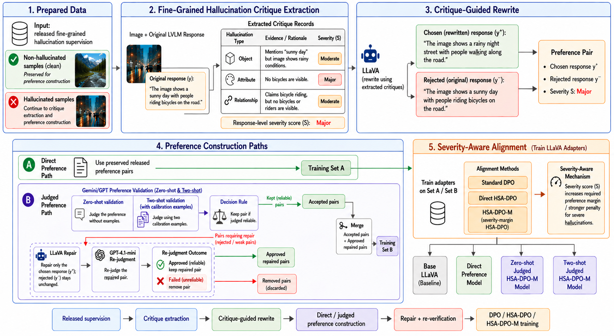

# Fine-Grained Hallucination Detection and Severity-Aware Mitigation in Vision-Language Models



## Project Metadata

### Authors

- **Team:** Fine-Grained Hallucination Mitigation
- **Members:** Abdulaziz Alqahtani and Alwaleed Alharthi
- **Supervisor Name:** Dr. Muzammil Behzad
- **Affiliations:** King Fahd University of Petroleum and Minerals (KFUPM)

## Introduction

Large vision-language models (LVLMs) can generate fluent image-grounded answers while still inventing unsupported objects, attributes, relationships, or scene details. These hallucinations are difficult to handle because a response may be partly correct and partly unsupported. A simple correct/incorrect label does not show where the hallucination occurs or how severe it is.

This project studies fine-grained hallucination mitigation for LVLMs. The pipeline starts from released fine-grained hallucination supervision, extracts structured critiques, constructs preference pairs, validates preference quality, repairs weak pairs, and trains LLaVA-style models with DPO and severity-aware HSA-DPO variants. The goal is not to claim universal improvement on every benchmark, but to reduce hallucination in generative and object hallucination settings while analyzing where the method helps and where it does not.

## Problem Statement

Given an image-question or image-instruction input `x` and an original LVLM response `y_hat`, the objective is to construct or select a better response `y` that is more visually grounded. The response should remove unsupported claims while preserving correct visual details.

The project focuses on three research questions:

Q1: Can released fine-grained hallucination annotations be converted into structured critique records that support preference construction?

Q2: Can judged preference validation and repair improve the quality of preference pairs used for alignment?

Q3: Does severity-aware DPO reduce hallucination compared with the base LLaVA model, standard DPO, and direct HSA-DPO?

## Application Area and Project Domain

This work belongs to multimodal machine learning, vision-language model alignment, and hallucination mitigation. The main use case is improving the reliability of LVLM answers in image-grounded generation tasks where unsupported visual claims can mislead users.

Potential applications include visual question answering, image captioning, assistive multimodal systems, educational tools, and any setting where a model must describe visual evidence accurately. The project is especially concerned with object, attribute, and relationship hallucinations.

## What is the paper trying to do, and what are you planning to do?

The paper proposes a fine-grained, severity-aware hallucination mitigation pipeline. Instead of treating all hallucinations equally, the method assigns severity information to preference pairs so that more serious hallucinations can receive stronger training pressure.

The implemented plan is:

1. Extract fine-grained critique records from released hallucination supervision.
2. Use critiques to guide LLaVA rewriting and construct chosen/rejected preference pairs.
3. Validate preference quality using zero-shot or two-shot Gemini/OpenAI judge prompts.
4. Repair rejected pairs with LLaVA and re-verify repaired pairs with `gpt-4.1-mini`.
5. Train LLaVA adapters using standard DPO, direct HSA-DPO, and judged severity-margin HSA-DPO-M.
6. Evaluate on POPE, Object HalBench, and AMBER.

### Project Documents

- **Presentation PDF:** Not exported in this repository; export from the editable PPTX when required.
- **Presentation PPTX:** [Project Presentation](asset/Fine-Grained%20Hallucination%20Detection%20and%20Severity-Aware%20Mitigation%20in%20Vision-Language.pptx)
- **Term Paper PDF:** [Term Paper](asset/paper/main.pdf)
- **Term Paper LaTeX Files:** [Paper Folder](asset/paper/)
- **Methodology Diagram:** [Diagram](asset/diagram_overview.png)
- **Result Summary:** [Result Summary CSV](reports/results_summary.csv)

### Reference Paper

- [Referenced Research Paper](asset/Referenced_Research_Paper.pdf)
- [Project Proposal Summary](asset/Proposal_summarized.pdf)
- [HSA-DPO Appendix](asset/HSA_DPO_Appendix.pdf)

### Reference GitHub

- [Project Repository](https://github.com/pr-Abdulaziz/Hallucination_Detection_VLM)

### Reference Dataset

- Released fine-grained hallucination supervision used to construct critique and preference data.
- LLaVA-style image preference data under `hsa_dpo/data/`.
- Visual Genome images when detection-side data paths require `vg/images/`.
- Evaluation benchmarks: POPE, Object HalBench, and AMBER.

## Project Technicalities

### Project UI

This project does not use a web UI. The interface is script-based and notebook-based:

- Shell scripts in `scripts/` run each pipeline stage.
- `notebooks/results_exploration.ipynb` generates result figures.
- The LaTeX paper is maintained under `asset/paper/`.

### Terminologies

- **LVLM:** Large vision-language model that processes images and text.
- **Hallucination:** A generated claim that is not supported by the image.
- **Fine-grained critique:** A structured explanation of a hallucination, including type, evidence, rationale, and severity.
- **Object hallucination:** Mentioning an object that is absent from the image.
- **Attribute hallucination:** Assigning an unsupported color, count, state, or property.
- **Relationship hallucination:** Describing an unsupported spatial or semantic relation between visual entities.
- **Preference pair:** A training pair with a chosen response and a rejected response for the same image/prompt.
- **DPO:** Direct Preference Optimization, which trains a model from preference pairs.
- **HSA-DPO:** Hallucination severity-aware DPO, where severity influences the training signal.
- **HSA-DPO-M:** A severity-margin variant that requires stronger preference separation for severe hallucinations.
- **Zero-shot judge:** A judge prompt without examples.
- **Two-shot judge:** A judge prompt with two calibration examples before the target case.

### Problem Statements

- **Problem 1:** LVLMs can produce visually unsupported details while maintaining fluent and plausible language.
- **Problem 2:** Coarse labels do not distinguish minor wording issues from severe object or relationship hallucinations.
- **Problem 3:** Preference pairs may be noisy if the chosen response still contains unsupported claims.
- **Problem 4:** A mitigation method may improve generative hallucination metrics without improving every benchmark equally.

### Loopholes or Research Areas

- **Preference quality:** Automatically constructed preference pairs can contain weak or ambiguous chosen responses.
- **Benchmark mismatch:** POPE, Object HalBench, and AMBER measure different hallucination behaviors.
- **Severity calibration:** Severity labels must be normalized carefully so they do not over-penalize minor errors.
- **Repair reliability:** LLaVA repair can improve weak pairs, but repaired outputs still require validation.
- **Compute cost:** Training and API-based validation require careful batching, workers, and artifact management.

### Problem vs. Ideation: Proposed 3 Ideas to Solve the Problems

1. **Fine-grained critique extraction:** Convert released annotations into structured hallucination records with type, evidence, rationale, and severity.
2. **Validated preference construction:** Use Gemini/OpenAI judgment, LLaVA repair, and OpenAI re-verification to reduce noisy preference pairs.
3. **Severity-aware optimization:** Train with DPO/HSA-DPO/HSA-DPO-M so severe hallucinations receive stronger alignment pressure.

### Proposed Solution: Code-Based Implementation

The repository implements an end-to-end hallucination mitigation pipeline:

- Stage 1 extracts fine-grained critique records from released supervision.
- Stage 2 rewrites hallucinated responses and constructs preference pairs.
- Stage 3 validates released preference pairs using zero-shot or two-shot judge prompts.
- Stage 4 repairs rejected pairs with local LLaVA.
- Stage 5 re-verifies repairs and trains severity-aware LLaVA adapters.
- Evaluation scripts compare the base model and trained variants on automatic hallucination benchmarks.

### Key Components

- **`fg_pipeline/paper/`**: pipeline modules for critique extraction, validation, repair, and training data preparation.
- **`fg_pipeline/eval/`**: evaluation and reporting utilities.
- **`hsa_dpo/`**: adapted LLaVA/HSA-DPO training code.
- **`hsa_dpo_train.sh`**: training entry point used by Stage 5 scripts.
- **`scripts/`**: minimized runnable entry points for the reported experiments.
- **`notebooks/results_exploration.ipynb`**: result plotting notebook using compact summary data.
- **`reports/results_summary.csv`**: compact metrics table retained instead of large raw outputs.
- **`asset/paper/main.tex`**: LaTeX source for the paper.
- **`asset/result_figures/`**: exported figures used by the paper and README.

## Model Workflow

The implemented workflow has five stages:

1. **Fine-grained critique extraction:** Parse hallucination annotations into structured records.
2. **Critique-guided rewrite:** Use LLaVA to rewrite hallucinated answers and build chosen/rejected pairs.
3. **Preference validation:** Use Gemini/OpenAI judges in zero-shot or two-shot mode to accept reliable pairs and reject weak pairs.
4. **Repair and re-verification:** Repair rejected chosen responses with LLaVA and re-check repaired pairs with `gpt-4.1-mini`.
5. **Severity-aware alignment:** Train LLaVA adapters with DPO, direct HSA-DPO, and HSA-DPO-M.

The final comparison includes:

| Variant | Description |
| --- | --- |
| Base LLaVA | Unaligned baseline |
| Standard DPO | Normal preference optimization |
| Direct HSA-DPO | Direct severity-aware training from released pairs |
| Zero-shot HSA-DPO-M | Judged severity-margin training with zero-shot validation |
| Two-shot HSA-DPO-M | Judged severity-margin training with two-shot validation |

## Repository Structure

```text
asset/
  diagram_overview.png            # methodology diagram
  paper/                          # LaTeX paper source, references, compiled PDF
  result_figures/                 # paper/README benchmark figures
  *.pdf, *.pptx                   # referenced papers and presentation assets
fg_pipeline/
  data/                           # small bundled pipeline data files
  paper/                          # paper-aligned pipeline modules
  stage1/ stage2/ stage3/ stage4/ # modular pipeline stages
  eval/                           # evaluation and reporting utilities
hsa_dpo/
  models/                         # adapted LLaVA/HSA-DPO model code
  trainer/                        # training utilities
  data/                           # lightweight data layout and samples
notebooks/
  results_exploration.ipynb       # result visualization notebook
reports/
  results_summary.csv             # compact result summary
  result_figures/                 # exported result figures
scripts/
  README.md                       # script entry-point guide
  run_paper_stage1_faif.sh
  run_paper_stage2_detector_dataset.sh
  run_paper_stage3_detect.sh
  run_paper_stage4_rewrite.sh
  run_paper_stage5_train_hsa.sh
  run_released_pref_stage3_validate.sh
  run_released_pref_stage4_repair.sh
  run_released_pref_stage5_openai_verify.sh
  run_direct_stage5_paper_hsa_batch32_epoch1.sh
  run_direct_stage5_normal_dpo_batch32_epoch1.sh
  run_2shot_verified_margin_hsa_batch32_epoch1.sh
  setup_stage5_eval_assets.sh
  watch_stage5_eval_after_training.sh
  watch_2shot_eval_after_training.sh
tests/
  test_*.py                       # unit and smoke tests
hsa_dpo_train.sh                  # main DPO/HSA-DPO training launcher
models.eval.example.json          # evaluation model config example
pyproject.toml                    # Python package/test configuration
```

Large model files, raw image folders, checkpoints, generated `output/` folders, archived `old_outputs/` folders, and temporary training artifacts should not be committed.

## How to Run the Code

### 1. Clone the Repository

```bash
git clone https://github.com/pr-Abdulaziz/Hallucination_Detection_VLM.git
cd Hallucination_Detection_VLM
```

### 2. Set Up the Environment

```bash
conda create -n hsa_dpo python=3.10
conda activate hsa_dpo
pip install -e .
pip install -e ".[linux-train]"
pip install -U huggingface_hub
```

Expected local model and data folders:

```text
models/llava-v1.5-7b/
hsa_dpo/data/hsa_dpo_preference_llava1dot5.jsonl
hsa_dpo/data/images/
vg/images/
```

API keys should be stored only in `.env` or environment variables. Do not commit `.env`.

### 3. Run Stage 1 and Stage 2

```bash
bash scripts/run_paper_stage1_faif.sh
bash scripts/run_paper_stage2_detector_dataset.sh
```

### 4. Optional Critique-Guided Rewrite Path

The diagram shows the critique-extraction path feeding a LLaVA rewrite step. The code supports this path directly from the Stage 1 critique records:

```bash
bash scripts/run_paper_stage4_rewrite.sh
```

If a local detector is used before rewriting, run:

```bash
bash scripts/run_paper_stage3_detect.sh
INPUT=output/fghd/paper_stage3/detections.jsonl bash scripts/run_paper_stage4_rewrite.sh
```

This creates:

```text
output/fghd/paper_stage4/rewrite_records.jsonl
output/fghd/paper_stage4/preference_pairs.jsonl
```

### 5. Run Judged Preference Validation

Zero-shot validation:

```bash
SHOT_MODE=zero_shot API_JUDGE=gemini_openai bash scripts/run_released_pref_stage3_validate.sh
```

Two-shot validation:

```bash
SHOT_MODE=two_shot WORKERS=3 API_JUDGE=gemini_openai bash scripts/run_released_pref_stage3_validate.sh
```

### 6. Repair and Re-Verify

```bash
SHOT_MODE=two_shot bash scripts/run_released_pref_stage4_repair.sh
SHOT_MODE=two_shot OPENAI_MODEL=gpt-4.1-mini bash scripts/run_released_pref_stage5_openai_verify.sh
```

The final two-shot verified preference file is saved to:

```text
output/fghd/released_pref_stage5_openai_verify_2shot_experiment/final_verified_preference_pairs.jsonl
```

### 7. Train the Models

Direct HSA-DPO:

```bash
bash scripts/run_direct_stage5_paper_hsa_batch32_epoch1.sh
```

Matched standard DPO:

```bash
bash scripts/run_direct_stage5_normal_dpo_batch32_epoch1.sh
```

Two-shot HSA-DPO-M:

```bash
bash scripts/run_2shot_verified_margin_hsa_batch32_epoch1.sh
```

Custom Stage 5 training:

```bash
DATA_PATH=hsa_dpo/data/hsa_dpo_preference_llava1dot5.jsonl \
IMAGE_FOLDER=hsa_dpo/data/images \
OUTPUT_DIR=output/fghd/custom_hsa_dpo \
DPO_LOSS_TYPE=hsa_weighted \
USE_REJECTED_SCORE=True \
USE_CHOSEN_SCORE=False \
bash scripts/run_paper_stage5_train_hsa.sh
```

### 8. Evaluate

```bash
bash scripts/setup_stage5_eval_assets.sh
bash scripts/watch_stage5_eval_after_training.sh
bash scripts/watch_2shot_eval_after_training.sh
```

The evaluation setup is automatic-metric based and does not require OpenAI or Gemini judge calls.

| Benchmark | Main reported metric |
| --- | --- |
| POPE adversarial | F1, accuracy, precision, recall |
| Object HalBench | CHAIRS, CHAIRI |
| AMBER | CHAIR, Cover, Hal, Cog |

Result figures are generated from:

```text
notebooks/results_exploration.ipynb
```

## Current Result Snapshot

The latest summarized local results separate POPE from the generative hallucination metrics because the two-shot POPE artifact did not contain valid recall/F1 fields.

POPE adversarial results with valid F1 values:

| Model variant | Accuracy | Precision | Recall | F1 |
| --- | ---: | ---: | ---: | ---: |
| Base LLaVA | 85.13 | 89.92 | 79.13 | 84.18 |
| Direct HSA-DPO | 85.03 | 90.70 | 78.07 | 83.91 |
| Standard DPO | 85.00 | 90.63 | 78.07 | 83.88 |
| Zero-shot HSA-DPO-M | 84.93 | 90.25 | 78.33 | 83.87 |

Note: the two-shot HSA-DPO-M variant is not included in the POPE table/plot because a valid two-shot POPE F1/recall evaluation was not available.

Hallucination-oriented generation metrics:

| Model variant | Object HalBench CHAIRS lower is better | Object HalBench CHAIRI lower is better | AMBER CHAIR lower is better | AMBER Hal lower is better |
| --- | ---: | ---: | ---: | ---: |
| Base LLaVA | 53.00 | 15.72 | 7.70 | 35.90 |
| Direct HSA-DPO | 38.00 | 11.74 | 5.50 | 25.10 |
| Standard DPO | 37.67 | 11.98 | 5.20 | 25.20 |
| Zero-shot HSA-DPO-M | 36.00 | 10.41 | 5.30 | 25.50 |
| Two-shot HSA-DPO-M | 40.33 | 12.81 | 5.60 | 26.90 |

The trained models improve strongly on Object HalBench and AMBER hallucination metrics, while POPE Adv. F1 remains slightly higher for the base model among runs with valid F1 values. Therefore, the results should be reported as benchmark-dependent rather than as a universal improvement claim.

## Git and Storage Notes

The repository is intended to track code, reports, notebooks, diagrams, paper files, and compact result summaries.

Do not commit:

- local API keys or `.env`
- raw model directories under `models/`
- Visual Genome image folders under `vg/`
- generated `output/` or `old_outputs/` folders
- large checkpoints
- temporary training caches

If full training artifacts are needed for backup, store them externally through cloud storage or a dedicated model artifact store rather than Git.

## Acknowledgments

- **Open-Source Communities:** This project builds on the released HSA-DPO method, the LLaVA training ecosystem, Hugging Face tooling, Visual Genome data, and open-source Python deep learning libraries.
- **Individuals:** The work was completed by Abdulaziz Alqahtani and Alwaleed Alharthi at KFUPM under the supervision of Dr. Muzammil Behzad.
- **Resource Providers:** The project was self-funded using rented VastAI GPU compute, including an NVIDIA RTX 6000 Ada Generation GPU with 48 GB VRAM, and hosted API usage; the total cost exceeded USD 120.
